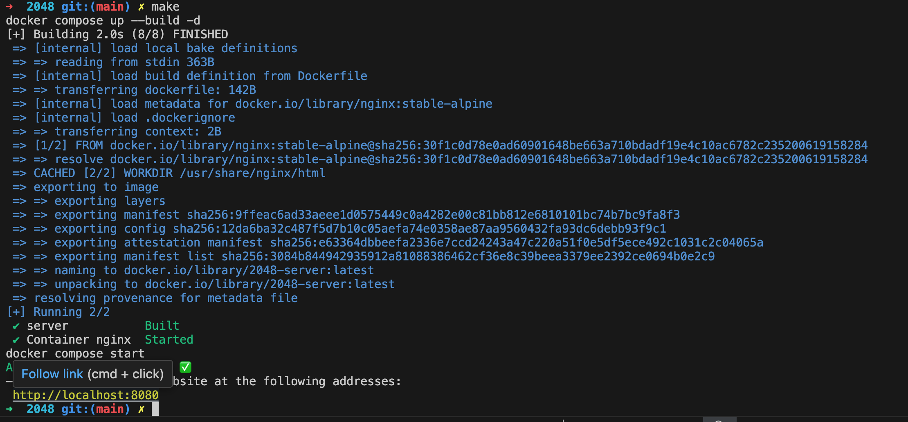
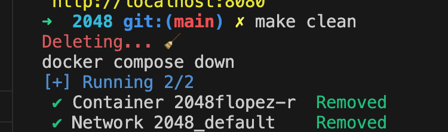
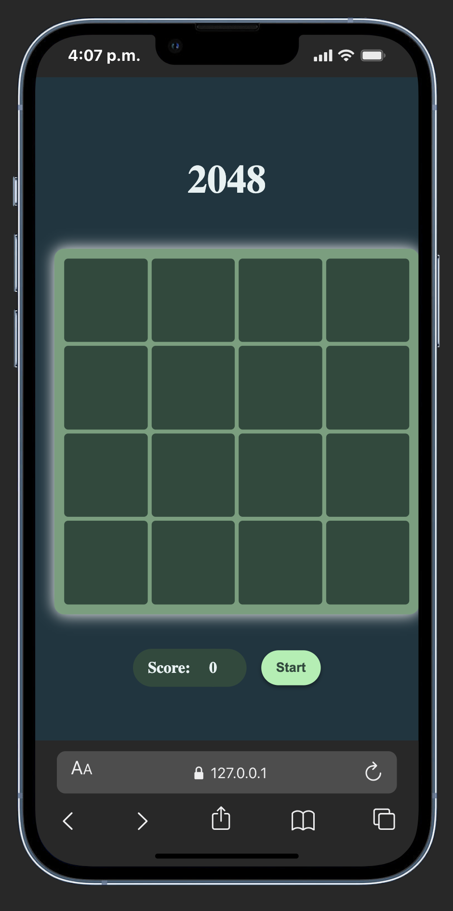
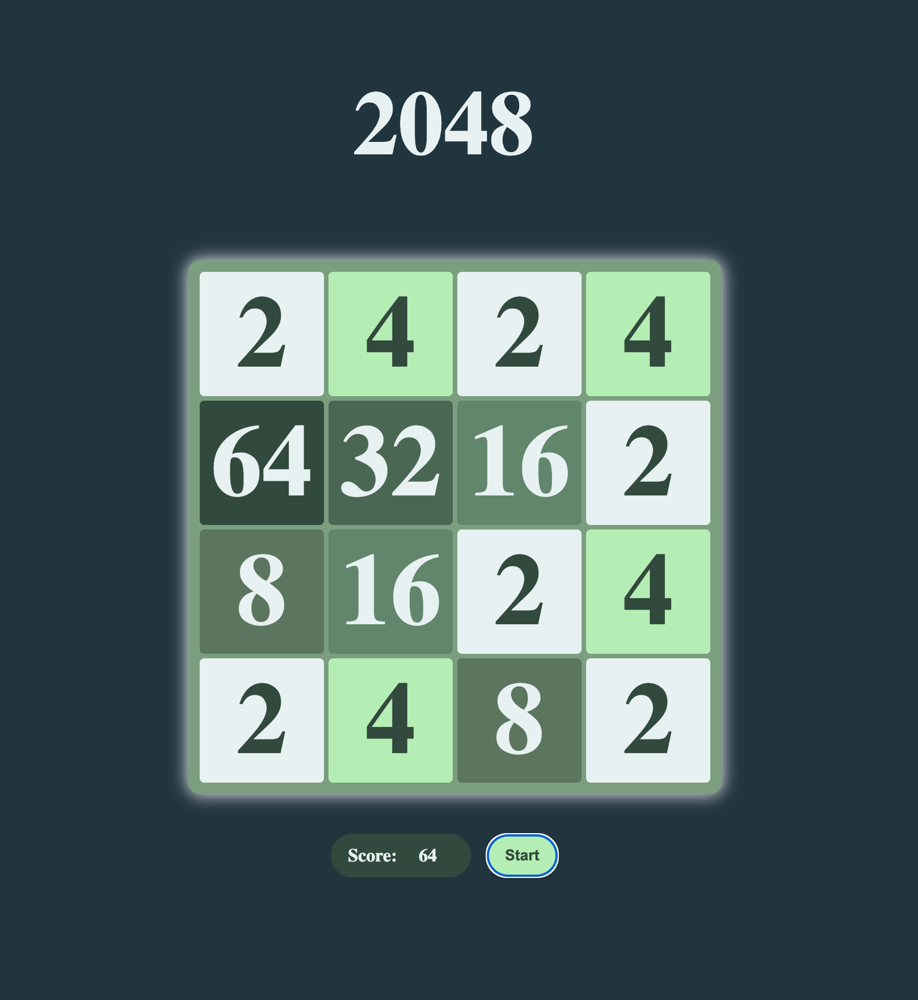

# 🎮 2048: El Juego de Deslizamiento Numérico

¡Hola!, este proyecto es 2048, atrévete a desafiar tus limites y llega a la puntuación máxima 2048!

## Características Destacadas ✨

* **Controles:** Soporte completo para **teclado** (flecha)
* **Diseño Responsive:** Optimizado para cualquier dispositivo.
* **Puntuación y Controles:** Muestra el puntaje acumulado y botones funcional de start con efecto *hover*.
* **Animaciones:** Animación de aparición (*pop-in*) para las fichas nuevas.


##  Requerimientos y Ejecución

Este proyecto utiliza **Docker** para crear un entorno aislado con un servidor web Nginx y **`make`** para simplificar la gestión del entorno.

### Requerimientos

Necesitas tener instalados en tu sistema:

1.  **Docker:** Para construir y ejecutar el contenedor del servidor web.
2.  **Make:** Para ejecutar los comandos de construcción y lanzamiento.

### ⚙️ Ejecución con `make`

Para poner en marcha el juego, solo necesitas ejecutar el comando `make` en la raíz del proyecto. Esto construirá la imagen de Docker y lanzará un servidor web ligero.

```bash
# Construye la imagen de Docker y lanza el servidor.
# El juego estará disponible en http://localhost:8080
make 
```


Verás algo como esto:



Accederás a la web haciendo command/ctrl + click

Puedes hacer lo siguiente para detener el servicio
```bash
make clean
```


## Estructura del proyecto
```bash
.
├── Makefile
├── README.md
├── docker
│   └── Dockerfile #Nginx Service
├── docker-compose.yml #Docker compose 
└── src
    └── public
        ├── index.html #Esqueleto de la página
        ├── styles.css #Estilos
        ├── keyBoardEvents.js # Funcionamiento 
        ├── types.js # de 
        ├── main.js # la 
        └── utils.js #Página ✅
```

## Vistas del juego:

### Movile


### Web


